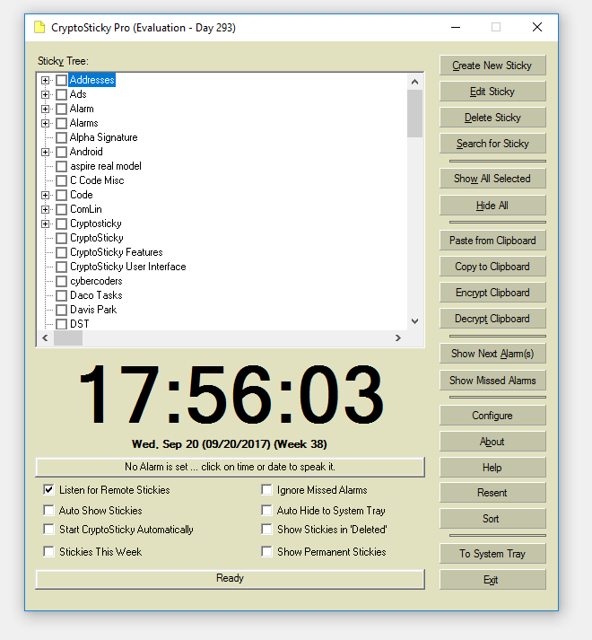

#CryptoSticky

Yellow notes (stickies) with alarm and encryption. In the process of portig to VC2015. 
Most of it works, not ready for deployment.
If you would like a working version, use the Snow Den edition from SF.

The code is published however to give you access to code snippets like:

    o Yellow Sticky display
    o Transparency etc ... 
    o Hashing title for file names
    o Lots of other tricks

Written in: Visual C++;

Update coming soon.

Warning: The encryption from different Cryptosticky versions are not 
compatible with each other. Introducing Unicode and MBCS changed things
around, so please decrypt all your secrets before installing a new version.

Alternatively, you may push the old data to a different directory and 
access it with the old version of the program.

Compile:

   VC2015  (with MFC support)
   Pull ../common/ encryption code and for bits and pieces

   Screenshot from work in progress.
   
   

